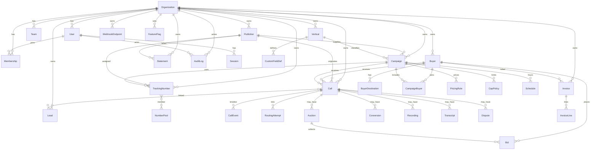

# ZCG Call Intelligence — Database

PostgreSQL 16. Prisma is the schema owner. Money uses `DECIMAL(19,4)`. Timestamps are `TIMESTAMPTZ` stored in UTC.

## 1. Conventions

| Rule | Implementation |
| --- | --- |
| Primary keys | `cuid()` strings |
| Public IDs | Prefixed human IDs (`pub_`, `buy_`, `cam_`, `call_`, `auc_`) |
| Money | `Decimal(19,4)` — dollars with 4 places (tenth of a mill) |
| Duration | integer **seconds** |
| Tenant column | `organizationId` on owned entities |
| Soft delete | `deletedAt` where recovery matters |
| Append-only | `CallEvent`, `AuditLog`, `ConsentRecord` — no update/delete APIs |
| Indexes | time, caller hash, campaign, publisher, buyer, status, conversion |

Sensitive phone numbers may additionally be stored encrypted at rest (application envelope) in P1; MVP stores E.164 and enforces **display masking** + PII permission.

## 2. ERD (MVP + forward tables)

## 3. Table notes

### Organization / User / Membership / Role

RBAC is **role + permission grants**. Built-in roles map to a permission set in code (`packages/shared`). Custom extra grants are rows on `MembershipPermission`.

### Publisher / Buyer

Buyers have many `BuyerDestination` (DID or SIP). Hours live on `Schedule` (timezone IANA, day-of-week, open/close, holidays, blackouts, temporary override). Never use the API server timezone.

### CampaignBuyer

Join table: buyer, priority, weight, campaign-specific rate override, allowed states, conversion override.

### Call

Financial columns are snapshotted at conversion/completion so historical P&L does not change if a rate card is edited later. Rate-card edits are audited.

### CallEvent

Append-only. `seq` monotonic per call. Payload JSON. Used by Inspector and Routing Debugger.

### RoutingAttempt

One row per dial/ping: destination, result (`NO_ANSWER`, `REJECTED`, `BUSY`, `ANSWERED`, `FAILED`, `CANCELLED`), explanation, timings.

### Conversion

Unique `(callId)` for MVP duration model (one billable conversion per call). P1 may add adjustment conversions with `parentConversionId`.

### Cap counters

`CapPolicy` in Postgres; live increment in Redis key `cap:{scope}:{id}:{window}`. Reconcile job hourly.

## 4. Index plan (P0)

- `Call(organizationId, startedAt DESC)`
- `Call(callerNumber, startedAt)`
- `Call(campaignId, startedAt)`
- `Call(publisherId, startedAt)`
- `Call(buyerId, startedAt)`
- `Call(status, startedAt)`
- `Call(convertedAt)` where converted
- `CallEvent(callId, seq)`
- `TrackingNumber(e164)` unique
- `Lead(phone, campaignId)`
- `Auction(callId)`
- `AuditLog(organizationId, createdAt)`

## 5. Migrations

- Prisma migrate is the only schema path.
- `prisma migrate diff` in CI.
- Never edit applied migration files.

## 6. Backups (ops contract)

Documented in `docs/DEPLOYMENT.md`: daily snapshots + WAL PITR for Postgres, versioned object-storage for recordings, encrypted secret store for recovery. Not implemented as code in P0.
